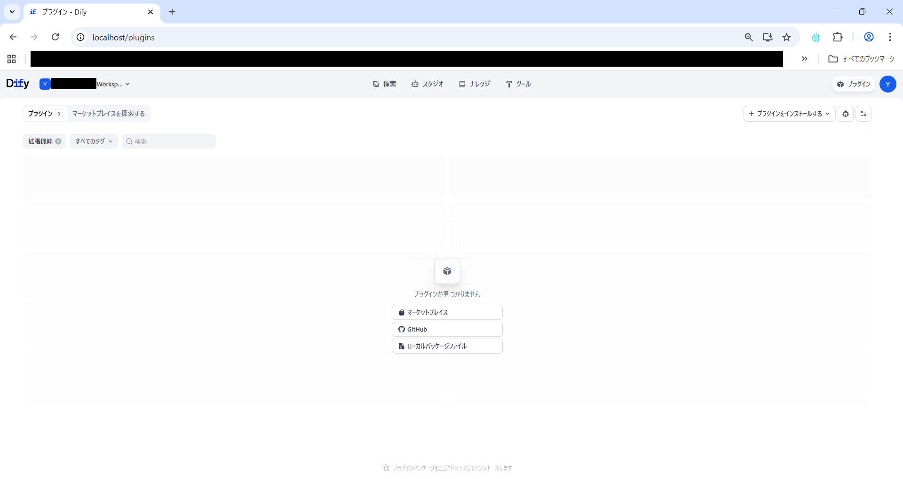
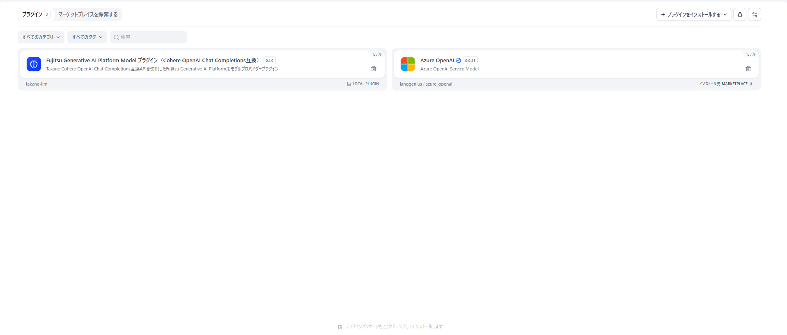
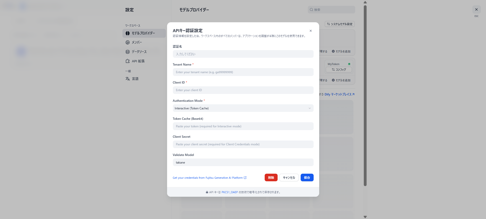

# Dify GAP API Model プラグイン利用手引き

## 📋 目次

- [Dify GAP API Model プラグイン利用手引き](#dify-gap-api-model-プラグイン利用手引き)
  - [📋 目次](#-目次)
  - [概要](#概要)
  - [動作環境](#動作環境)
    - [確認済み環境](#確認済み環境)
  - [セットアップ](#セットアップ)
    - [前提条件](#前提条件)
    - [プラグインのダウンロード](#プラグインのダウンロード)
    - [認証ヘルパースクリプトの準備](#認証ヘルパースクリプトの準備)
    - [プラグインのインストール](#プラグインのインストール)
    - [認証情報の取得](#認証情報の取得)
      - [実行手順](#実行手順)
    - [プラグインへの認証情報設定](#プラグインへの認証情報設定)
  - [使用方法](#使用方法)
    - [サンプル DSL ファイルのインポート](#サンプル-dsl-ファイルのインポート)
    - [基本的な使い方](#基本的な使い方)
    - [⚠️ 制限事項](#️-制限事項)
  - [GAP API 対応表](#gap-api-対応表)
  - [セキュリティに関する注意事項](#セキュリティに関する注意事項)
    - [🔒 トークンの管理](#-トークンの管理)
  - [更新履歴](#更新履歴)

## 概要

本プラグインは、Dify 上で Generative AI Platform（GAP）API を利用可能にするための Model プラグインです。
GAP API と Dify を統合することで、Dify のワークフロー内から GAP の LLM との会話機能を活用できます。

Model プラグインは、GAP の LLM との会話を Dify のモデルとして利用するためのプラグインです。

| 利用可能な GAP API                          |
| ------------------------------------------- |
| Cohere OpenAI Chat Completions 互換API |

## 動作環境

### 確認済み環境

- **Dify**: コミュニティ版
- **OS**: Linux(WSL で動作確認を実施しています)
- **Python**: 3.11 以上（認証ヘルパースクリプト実行用）

## セットアップ

### 前提条件

- Dify コミュニティ版がインストール済みであること
  - インストール手順は、以下の公式ドキュメントを参照してください。
    - [https://docs.dify.ai/ja/self-host/quick-start/docker-compose](https://docs.dify.ai/ja/self-host/quick-start/docker-compose)
  - (補足) WSL 環境でのインストール手順の詳細については、以下の記事も参考になります。
    - [https://qiita.com/yutaka-tanaka/items/1cebb6db744aa5a01f0c](https://qiita.com/yutaka-tanaka/items/1cebb6db744aa5a01f0c)
- Python 3.11 以上がインストール済みであること
- GAP のテナント名、クライアント ID を取得済みであること
- GAP アプリの認証に使用する Entra ID のアカウントを持っていること

### プラグインのダウンロード

以下のファイルをダウンロードしてください：

- `gap-model-plugin.difypkg` - Model プラグイン
- `auth_helper.py` - 認証ヘルパースクリプト
- `GAPテストチャット.yml` - サンプルチャットフロー DSL ファイル

### 認証ヘルパースクリプトの準備

1. `auth_helper.py`をローカル PC の任意の場所に配置
2. コマンドプロンプトまたはターミナルで配置した場所に移動

### プラグインのインストール

1. Dify の管理画面で「プラグイン」セクションに移動
2. 「ローカルプラグインのインストール」を選択
3. ダウンロードした `gap-model-plugin.difypkg` を選択してインストール



> **💡 ヒント**: インストールが成功すると、プラグイン一覧に「Fujitsu Generative AI Platform Model プラグイン（Cohere OpenAI Chat Completions互換）」が表示されます。



### 認証情報の取得

対話認証（Interactive(Token Cache)）を使用する場合に実施する手順です。非対話認証（Client Credentials(Secret Key)）を使用する場合は、この手順をスキップしてください。

⚠️ **重要**: 取得した認証トークンは機微情報（API シークレット相当）として厳重に管理してください。

#### 実行手順

1. コマンドプロンプトで以下のコマンドを実行：

```bash
python auth_helper.py --tenant <テナント名> --client-id <クライアントID>
```

2. ブラウザが自動的に起動し、Entra ID のログイン画面が表示されます
3. Entra ID でログインを完了
4. コマンドプロンプトに取得したトークン情報が表示されます

**表示されるトークン情報：**

```
>python auth_helper.py --tenant <テナント名> --client-id <クライアントID>
eyJ0eXAiOiJKV1QiLCJhbGc...(長い文字列)
```

**⚠️ 重要**: 表示されたトークン全体をコピーして、安全な場所に保存してください。このトークンは次のステップで使用します。

### プラグインへの認証情報設定

1. Dify の「モデルプロバイダー一覧」一覧から「Fujitsu」を選択
2. プラグインの設定画面が表示されます
3. 認証情報編集画面で以下の情報を入力：
   - **認証名**: 任意の名前
   - **Tenant Name**: GAP のテナント名
   - **Client ID**: GAP のクライアント ID
   - **Authentication Mode**: 以下のいずれかを選択
     - `Interactive(Token Cache)` — 対話認証（auth_helper.py を使用する方法）
     - `Client Credentials(Secret Key)` — 非対話認証（クライアントシークレットを使う方法）
   - **Token Cache(Base64)**: 対話認証の場合に入力。auth_helper.py で取得したトークン文字列を入力
   - **Client Secret**: 非対話認証の場合に入力。クライアントシークレットを入力
   - **Validate Model**: 初期値（takane）のまま
4. 「保存」ボタンをクリックして設定を保存



## 使用方法

Model プラグインは、他の LLM モデルプラグイン（OpenAI、Anthropic など）と同様に Dify のワークフローで使用できます。

### サンプル DSL ファイルのインポート

GAP Model プラグインを使用したチャットフローのサンプル DSL ファイル（`GAPテストチャット.yml`）を用意しています。このファイルをインポートすることで、GAP の LLM を利用するチャットフローをすぐに作成できます。

1. ダウンロードした `GAPテストチャット.yml` を用意
2. Dify の画面左上の「スタジオ」をクリック
3. 「DSL ファイルをインポート」を選択
4. `GAPテストチャット.yml` を選択してインポート
5. インポートが完了すると、GAP の takane モデルを使用したチャットフローが作成されます

> **💡 ヒント**: インポート後、プラグインの認証情報設定が完了していれば、そのままチャットフローを実行できます。

### 基本的な使い方

1. Dify のワークフロー編集画面を開く
2. 「LLM」ノードをワークフローに追加
3. LLM ノードの設定で、モデルプロバイダーから「Fujitsu」を選択
4. モデル一覧から使用するモデルを選択
5. プロンプト（入力テキスト）を設定
6. ワークフローを実行すると、GAP の LLM が応答を返します

### ⚠️ 制限事項

以下の点にご注意ください：

| 項目                     | 制限内容                                                     |
| ------------------------ | ------------------------------------------------------------ |
| **トークン数・料金表示** | ダミー表記であり、実際の使用量とは異なります |

## GAP API 対応表

| GAP API                                                        | 対応状況    |
| -------------------------------------------------------------- | ----------- |
| Cohere OpenAI Chat Completions 互換API `/compatibility/v1/chat/completions` | ✅ 利用可能 |

## セキュリティに関する注意事項

### 🔒 トークンの管理

認証ヘルパースクリプトで取得したトークンは、**API シークレットと同等の機微情報**です。

**必ず以下を守ってください：**

- ❌ トークンを他人と共有しない
- ❌ Git や Public リポジトリにコミットしない
- ❌ トークンをチャットやメールで送信しない
- ❌ トークンをスクリーンショットに含めない

---

## 更新履歴

- 2025-11-27: 初版リリース
- 2026-01-05: Dify コミュニティ版のインストール方法について、公式ドキュメントへの参照を追加
- 2026-04-21: Model プラグイン専用の利用手引きとして分割
- 2026-04-22: Cohere OpenAI Chat Completions 互換API 対応に伴う更新
- 2026-04-23: サンプルチャットフロー DSL ファイル（GAPテストチャット.yml）のインポート手順を追加
