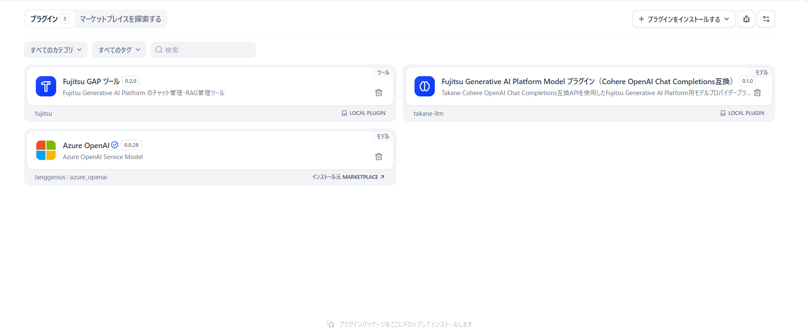
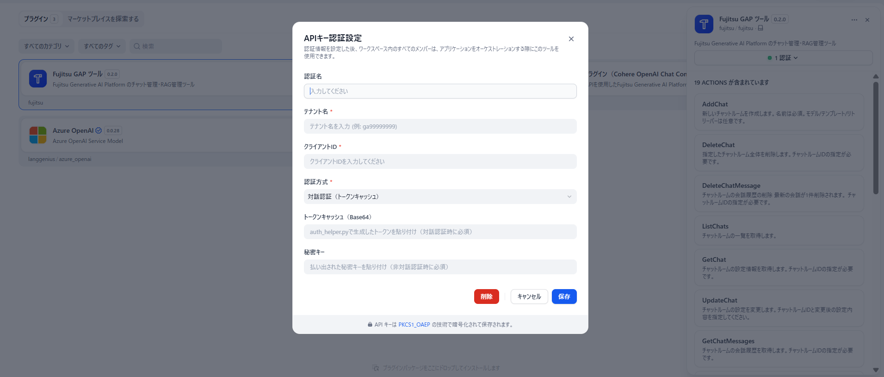

# Dify GAP API Tool プラグイン利用手引き

## 📋 目次

- [Dify GAP API Tool プラグイン利用手引き](#dify-gap-api-tool-プラグイン利用手引き)
  - [📋 目次](#-目次)
  - [概要](#概要)
  - [動作環境](#動作環境)
    - [確認済み環境](#確認済み環境)
  - [セットアップ](#セットアップ)
    - [前提条件](#前提条件)
    - [プラグインのダウンロード](#プラグインのダウンロード)
    - [認証ヘルパースクリプトの準備](#認証ヘルパースクリプトの準備)
    - [プラグインのインストール](#プラグインのインストール)
    - [認証情報の取得](#認証情報の取得)
      - [実行手順](#実行手順)
    - [プラグインへの認証情報設定](#プラグインへの認証情報設定)
  - [使用方法](#使用方法)
    - [サンプル DSL ファイルのインポート](#サンプル-dsl-ファイルのインポート)
    - [ツールの追加方法](#ツールの追加方法)
    - [チャット管理ツール](#チャット管理ツール)
      - [AddChat](#addchat)
      - [ListChats](#listchats)
      - [GetChat](#getchat)
      - [UpdateChat](#updatechat)
      - [DeleteChat](#deletechat)
      - [AddChatMessages](#addchatmessages)
      - [GetChatMessages](#getchatmessages)
      - [DeleteChatMessage](#deletechatmessage)
      - [CreateNextAiMessage](#createnextaimessage)
      - [SimpleChat](#simplechat)
    - [RAG／リトリーバー管理ツール](#ragリトリーバー管理ツール)
      - [CreateRetriever](#createretriever)
      - [RetrieverList](#retrieverlist)
      - [GetRetriever](#getretriever)
      - [DeleteRetriever](#deleteretriever)
      - [EmbeddingFiles](#embeddingfiles)
    - [ファイル管理ツール](#ファイル管理ツール)
      - [UploadFiles](#uploadfiles)
      - [FileList](#filelist)
      - [AddFileFromUrl](#addfilefromurl)
      - [DeleteFile](#deletefile)
  - [GAP API 対応表](#gap-api-対応表)
  - [Dify ファイルアップロードと UploadFiles の連携](#dify-ファイルアップロードと-uploadfiles-の連携)
    - [⚠️ 対応ファイル形式に関する制限事項](#️-対応ファイル形式に関する制限事項)
    - [ワークフロー構成例](#ワークフロー構成例)
    - [コード実行ノードのサンプルコード（Base64 変換）](#コード実行ノードのサンプルコードbase64-変換)
  - [セキュリティに関する注意事項](#セキュリティに関する注意事項)
    - [🔒 トークン・シークレットの管理](#-トークンシークレットの管理)
  - [更新履歴](#更新履歴)

## 概要

本プラグインは、Dify 上で Generative AI Platform（GAP）API を利用可能にするための Tool プラグインです。
GAP API と Dify を統合することで、Dify のワークフロー内から GAP のチャット管理・RAG 管理・ファイル管理機能を活用できます。

| カテゴリ | ツール数 | 主な機能 |
| -------- | -------: | -------- |
| チャット管理 | 10 | チャットルーム CRUD、メッセージ投稿、AI 回答生成、簡易チャット |
| RAG／リトリーバー管理 | 5 | リトリーバー CRUD、Embedding 実行 |
| ファイル管理 | 4 | ファイルアップロード（Base64 / URL）、一覧、削除 |

> **📝 注意**: GAP の LLM との会話をモデルとして利用する場合は、別途 [Model プラグイン利用手引き](DifyGapAPI_Modelプラグイン利用手引き.md) を参照してください。

## 動作環境

### 確認済み環境

- **Dify**: コミュニティ版
- **OS**: Linux(WSL で動作確認を実施しています)
- **Python**: 3.11 以上（認証ヘルパースクリプト実行用）

## セットアップ

### 前提条件

- Dify コミュニティ版がインストール済みであること
  - インストール手順は、以下の公式ドキュメントを参照してください。
    - [https://docs.dify.ai/ja/self-host/quick-start/docker-compose](https://docs.dify.ai/ja/self-host/quick-start/docker-compose)
  - (補足) WSL 環境でのインストール手順の詳細については、以下の記事も参考になります。
    - [https://qiita.com/yutaka-tanaka/items/1cebb6db744aa5a01f0c](https://qiita.com/yutaka-tanaka/items/1cebb6db744aa5a01f0c)
- Python 3.11 以上がインストール済みであること
- GAP のテナント名、クライアント ID を取得済みであること
- GAP アプリの認証に使用する Entra ID のアカウントを持っていること

### プラグインのダウンロード

以下のファイルをダウンロードしてください：

- `gap-tool-plugin.difypkg` - Tool プラグイン
- `auth_helper.py` - 認証ヘルパースクリプト
- `RAGチャットフロー.yml` - サンプル RAG チャットフロー DSL ファイル

### 認証ヘルパースクリプトの準備

1. `auth_helper.py`をローカル PC の任意の場所に配置
2. コマンドプロンプトまたはターミナルで配置した場所に移動

### プラグインのインストール

1. Dify の管理画面で「プラグイン」セクションに移動
2. 「ローカルプラグインのインストール」を選択
3. ダウンロードした `gap-tool-plugin.difypkg` を選択してインストール


> **💡 ヒント**: インストールが成功すると、プラグイン一覧に「Fujitsu GAP ツール」が表示されます。



### 認証情報の取得

対話認証（Interactive(Token Cache)）を使用する場合に実施する手順です。非対話認証（Client Credentials(Secret Key)）を使用する場合は、この手順をスキップしてください。

⚠️ **重要**: 取得した認証トークンは機微情報（API シークレット相当）として厳重に管理してください。

#### 実行手順

1. コマンドプロンプトで以下のコマンドを実行：

```bash
python auth_helper.py --tenant <テナント名> --client-id <クライアントID>
```

2. ブラウザが自動的に起動し、Entra ID のログイン画面が表示されます
3. Entra ID でログインを完了
4. コマンドプロンプトに取得したトークン情報が表示されます

**表示されるトークン情報：**

```
>python auth_helper.py --tenant <テナント名> --client-id <クライアントID>
eyJ0eXAiOiJKV1QiLCJhbGc...(長い文字列)
```

**⚠️ 重要**: 表示されたトークン全体をコピーして、安全な場所に保存してください。このトークンは次のステップで使用します。

### プラグインへの認証情報設定

1. Dify の「インストール済みプラグイン」一覧から「Fujitsu クラウドサービス Generative AI Platform Tool プラグイン」を選択
2. プラグインの設定画面が表示されます
3. 認証情報編集画面で以下の情報を入力：

| 項目 | 説明 | 備考 |
| ---- | ---- | ---- |
| **テナント名** | GAP のテナント名（例: `ga99999999`） | 必須 |
| **クライアント ID** | GAP のクライアント ID | 必須 |
| **認証方式** | 以下のいずれかを選択 | 必須（デフォルト: Interactive） |
| | `Interactive (Token Cache)` — 対話認証（auth_helper.py を使用する方法） | |
| | `Client Credentials (Secret Key)` — 非対話認証（クライアントシークレットを使う方法） | |
| **トークンキャッシュ（Base64）** | 対話認証の場合に入力。auth_helper.py で取得したトークン文字列を入力 | Interactive 方式の場合に入力 |
| **クライアントシークレット** | 非対話認証の場合に入力。Entra ID アプリのシークレットキーを入力 | Client Credentials 方式の場合に入力 |

4. 「保存」ボタンをクリックして設定を保存



> **📝 注意**: Interactive 方式と Client Credentials 方式の両方の認証情報を入力しておき、認証方式の選択で切り替えることもできます。

## 使用方法

Tool プラグインには、GAP の各種 API に対応した **19 個のツール** が含まれています。これらのツールは、Dify のワークフロー内で「ツール」ノードとして利用できます。

### サンプル DSL ファイルのインポート

GAP Tool プラグインを使用した RAG チャットフローのサンプル DSL ファイル（`RAGチャットフロー.yml`）を用意しています。このファイルをインポートすることで、ファイルアップロードから RAG 検索・AI 回答生成・後片付けまでを一連で行うワークフローをすぐに作成できます。

1. ダウンロードした `RAGチャットフロー.yml` を用意
2. Dify の画面左上の「スタジオ」をクリック
3. 「DSL ファイルをインポート」を選択
4. `RAGチャットフロー.yml` を選択してインポート
5. インポートが完了すると、以下の処理を順番に実行する RAG チャットフローが作成されます

**ワークフローの処理フロー：**

```
[開始: ファイル入力（File 型）]
  │
  ▼
[テキスト抽出] ─ アップロードされたファイルからテキストを抽出
  │
  ▼
[抽出したテキストをb64変換] ─ Base64 エンコード + ファイル名を .txt に変換
  │
  ▼
[UploadFiles] ─ GAP にファイルをアップロード
  │
  ▼
[file_id抽出] ─ レスポンスからファイル ID を取得
  │
  ▼
[CreateRetriever] ─ リトリーバー（RAG データ領域）を作成
  │
  ▼
[retriever_id抽出] ─ レスポンスからリトリーバー ID を取得
  │
  ▼
[EmbeddingFiles] ─ ファイルを RAG データに変換（Embedding）
  │
  ▼
[GetRetriever] ─ Embedding 状態を確認
  │
  ▼
[RetrieverList] ─ リトリーバー一覧を取得
  │
  ▼
[AddChat] ─ リトリーバーを紐付けたチャットルームを作成
  │
  ▼
[chat_id抽出] ─ レスポンスからチャットルーム ID を取得
  │
  ▼
[AddChatMessages] ─ ユーザーメッセージを投稿
  │
  ▼
[CreateNextAiMessage] ─ AI の回答を生成
  │
  ▼
[DeleteChatMessage] ─ 会話履歴を削除
  │
  ▼
[DeleteChat] ─ チャットルームを削除
  │
  ▼
[DeleteRetriever] ─ リトリーバーを削除
  │
  ▼
[DeleteFile] ─ アップロードしたファイルを削除
  │
  ▼
[終了]
```

> **💡 ヒント**: インポート後、プラグインの認証情報設定が完了していれば、そのままワークフローを実行できます。開始ノードでファイルをアップロードすると、RAG を活用した AI 回答が得られます。


### ツールの追加方法

1. Dify のワークフロー編集画面で「ツール」ノードを追加
2. ツール選択画面で「Fujitsu GAP ツール」配下のツールを選択
3. 必要なパラメータを設定して実行

---

### チャット管理ツール

#### AddChat

新しいチャットルームを作成します。

> **📝 注意**: 対話認証（Interactive(Token Cache)）で認証した場合、作成されたチャットルームは GAP アプリ上でも確認できます。非対話認証（Client Credentials(Secret Key)）で認証した場合は、GAP アプリ上では確認できません。

| パラメータ | 型 | 必須 | 説明 |
| ---------- | -- | ---- | ---- |
| name | string | ✅ | チャットルームの名前 |
| retriever_ids | string | - | 紐付けるリトリーバーID（カンマ区切りで複数指定可） |

#### ListChats

チャットルームの一覧を取得します。パラメータはありません。

#### GetChat

チャットルームの設定情報を取得します。

| パラメータ | 型 | 必須 | 説明 |
| ---------- | -- | ---- | ---- |
| chat_room_id | string | ✅ | 取得対象のチャットルーム ID |

#### UpdateChat

チャットルームの設定を変更します。

| パラメータ | 型 | 必須 | 説明 |
| ---------- | -- | ---- | ---- |
| chat_room_id | string | ✅ | 変更対象のチャットルーム ID |
| name | string | - | 新しいチャットルーム名 |
| retriever_ids | string | - | 紐付けるリトリーバーID（カンマ区切り） |
| temperature | number | - | Temperature（0.0〜1.0） |
| max_tokens | number | - | 最大トークン数 |

#### DeleteChat

指定したチャットルームを削除します。**削除後は復元できません。**

| パラメータ | 型 | 必須 | 説明 |
| ---------- | -- | ---- | ---- |
| chat_room_id | string | ✅ | 削除対象のチャットルーム ID |

#### AddChatMessages

チャットルームにユーザーメッセージを投稿します。

| パラメータ | 型 | 必須 | 説明 |
| ---------- | -- | ---- | ---- |
| chat_room_id | string | ✅ | 投稿先のチャットルーム ID |
| content | string | ✅ | 投稿するメッセージ内容 |

#### GetChatMessages

チャットルームの会話履歴を取得します。

| パラメータ | 型 | 必須 | 説明 |
| ---------- | -- | ---- | ---- |
| chat_room_id | string | ✅ | 取得対象のチャットルーム ID |

#### DeleteChatMessage

チャットルームの最新のメッセージを 1 件削除します。

| パラメータ | 型 | 必須 | 説明 |
| ---------- | -- | ---- | ---- |
| chat_room_id | string | ✅ | 対象のチャットルーム ID |

#### CreateNextAiMessage

チャットルームで AI の回答を生成します。**AddChatMessages でユーザーメッセージを投稿した後に使用してください。**

| パラメータ | 型 | 必須 | 説明 |
| ---------- | -- | ---- | ---- |
| chat_room_id | string | ✅ | 対象のチャットルーム ID |

#### SimpleChat

チャットルームを作成せずに簡易的な会話を行います。単発の質問に適しています。

| パラメータ | 型 | 必須 | デフォルト | 説明 |
| ---------- | -- | ---- | ---------- | ---- |
| question | string | ✅ | - | 質問文 |
| model | string | - | cohere.command-r-plus-fujitsu | 使用するモデル名 |
| temperature | number | - | 0.5 | Temperature（0.0〜1.0） |
| max_tokens | number | - | 1024 | 最大トークン数 |
| messages_json | string | - | - | 過去の会話履歴（JSON 配列形式） |

> `messages_json` の形式: `[{"role":"user","content":"..."},{"role":"ai","content":"..."}]`

---

### RAG／リトリーバー管理ツール

#### CreateRetriever

リトリーバー（RAG データ領域）を新規作成します。

| パラメータ | 型 | 必須 | 説明 |
| ---------- | -- | ---- | ---- |
| name | string | ✅ | リトリーバーの名前 |

#### RetrieverList

リトリーバーの一覧を取得します。パラメータはありません。

#### GetRetriever

リトリーバーの詳細情報と Embedding 状態を取得します。

| パラメータ | 型 | 必須 | 説明 |
| ---------- | -- | ---- | ---- |
| retriever_id | string | ✅ | 対象のリトリーバー ID |

> レスポンスの `origin_ids` が空の場合、Embedding がまだ完了していません。

#### DeleteRetriever

リトリーバー（RAG データ）を削除します。

| パラメータ | 型 | 必須 | 説明 |
| ---------- | -- | ---- | ---- |
| retriever_id | string | ✅ | 削除対象のリトリーバー ID |

#### EmbeddingFiles

アップロード済みファイルを RAG データに変換（Embedding）します。

| パラメータ | 型 | 必須 | 説明 |
| ---------- | -- | ---- | ---- |
| retriever_id | string | ✅ | Embedding 先のリトリーバー ID |
| file_ids | string | ✅ | 対象ファイル ID（カンマ区切りで複数指定可） |

---

### ファイル管理ツール

#### UploadFiles

RAG 用にファイルを Base64 エンコードでアップロードします。

| パラメータ | 型 | 必須 | デフォルト | 説明 |
| ---------- | -- | ---- | ---------- | ---- |
| file_content_b64 | string | ✅ | - | ファイル内容の Base64 エンコード文字列 |
| file_name | string | ✅ | - | 拡張子を含むファイル名（例: `document.txt`） |
| content_type | string | - | application/octet-stream | ファイルの MIME タイプ |

> **⚠️ Dify ファイルアップロードとの連携時は `.txt` 形式のみ対応です。** 詳細は [Dify ファイルアップロードと UploadFiles の連携](#dify-ファイルアップロードと-uploadfiles-の連携) を参照してください。

#### FileList

アップロード済みファイルの一覧を取得します。パラメータはありません。

#### AddFileFromUrl

URL からファイルを取り込みます。

| パラメータ | 型 | 必須 | 説明 |
| ---------- | -- | ---- | ---- |
| url | string | ✅ | 取り込み元の URL |
| name | string | ✅ | ファイル名（拡張子を含む。例: `example.html`） |

#### DeleteFile

アップロード済みファイルを削除します。

| パラメータ | 型 | 必須 | 説明 |
| ---------- | -- | ---- | ---- |
| file_id | string | ✅ | 削除対象のファイル ID |

---

## GAP API 対応表

| カテゴリ | GAP API | ツール名 | 対応状況 |
| -------- | ------- | -------- | -------- |
| チャット管理 | Add Chat | AddChat | ✅ 利用可能 |
| | List Chats | ListChats | ✅ 利用可能 |
| | Get Chat | GetChat | ✅ 利用可能 |
| | Update Chat | UpdateChat | ✅ 利用可能 |
| | Delete Chat | DeleteChat | ✅ 利用可能 |
| | Add Chat Messages | AddChatMessages | ✅ 利用可能 |
| | Get Chat Messages | GetChatMessages | ✅ 利用可能 |
| | Remove Last Message | DeleteChatMessage | ✅ 利用可能 |
| | Create Next AI Message | CreateNextAiMessage | ✅ 利用可能 |
| | Simple Chat | SimpleChat | ✅ 利用可能 |
| RAG 管理 | Create Retriever | CreateRetriever | ✅ 利用可能 |
| | Retriever List | RetrieverList | ✅ 利用可能 |
| | Get Retriever | GetRetriever | ✅ 利用可能 |
| | Delete Retriever | DeleteRetriever | ✅ 利用可能 |
| | Embedding Files | EmbeddingFiles | ✅ 利用可能 |
| ファイル管理 | Upload Files | UploadFiles | ✅ 利用可能 |
| | File List | FileList | ✅ 利用可能 |
| | Add File From URL | AddFileFromUrl | ✅ 利用可能 |
| | Delete File | DeleteFile | ✅ 利用可能 |

---

## Dify ファイルアップロードと UploadFiles の連携

Dify のワークフローでユーザーがアップロードしたファイルを GAP にアップロードする場合、Dify の **テキスト抽出ノード** で文字列を抽出し、**コード実行ノード** で Base64 エンコードして UploadFiles ツールに渡す構成になります。

### ⚠️ 対応ファイル形式に関する制限事項

Dify のテキスト抽出ノードはファイルの内容をプレーンテキスト文字列として抽出するため、**GAP へのアップロードは `.txt` 形式のみの対応** となります。

- 元ファイルが PDF・XLSX・DOCX 等の場合でも、テキスト抽出後は純粋なテキストデータになります
- そのため、GAP へは拡張子を `.txt` に変換してアップロードする必要があります
- 元ファイルのレイアウト・書式・画像等は保持されません
- 画像ベースの PDF（スキャン PDF）ではテキストを抽出できない場合があります

### ワークフロー構成例

```
[Start: ファイル入力（File 型）+ 質問（String 型）]
  │
  ▼
[テキスト抽出]
  │
  ▼
[コード実行ノード: Base64 変換 + ファイル名 .txt 化]
  │
  ▼
[UploadFiles ツール]
```

### コード実行ノードのサンプルコード（Base64 変換）

**入力変数**: `extracted_text` (String) = テキスト抽出ノードの出力、`file_name` (String) = Start ノードのアップロードファイル名

```python
import base64
import os

def main(extracted_text: str, file_name: str) -> dict:
    file_bytes = extracted_text.encode("utf-8")
    file_content_b64 = base64.b64encode(file_bytes).decode("ascii")
    txt_name = os.path.splitext(file_name)[0] + ".txt"
    return {
        "file_content_b64": file_content_b64,
        "file_name": txt_name,
        "content_type": "text/plain",
    }
```

> コード実行ノードの出力 `file_content_b64`、`file_name`、`content_type` をそのまま UploadFiles ツールの各パラメータに接続します。

---

## セキュリティに関する注意事項

### 🔒 トークン・シークレットの管理

認証ヘルパースクリプトで取得したトークンおよびクライアントシークレットは、**API シークレットと同等の機微情報**です。

**必ず以下を守ってください：**

- ❌ トークン・シークレットを他人と共有しない
- ❌ Git や Public リポジトリにコミットしない
- ❌ チャットやメールで送信しない
- ❌ スクリーンショットに含めない

---

## 更新履歴

- 2025-11-27: 初版リリース
- 2026-01-05: Dify コミュニティ版のインストール方法について、公式ドキュメントへの参照を追加
- 2026-04-21: Tool プラグイン専用の利用手引きとして分割
- 2026-05-11: 全 19 ツール対応に改訂、認証方式（Interactive / Client Credentials）の説明追加、Dify ファイルアップロード連携の注意事項追加
