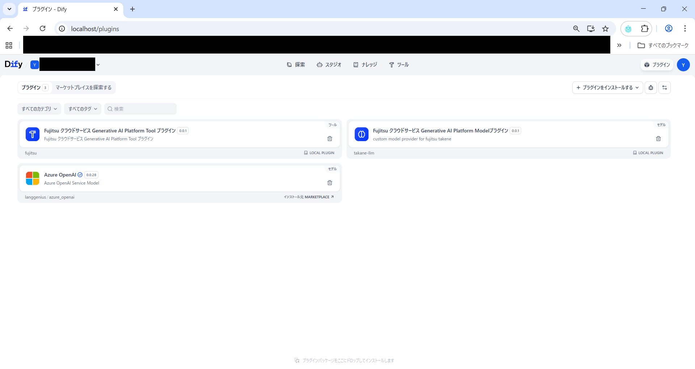
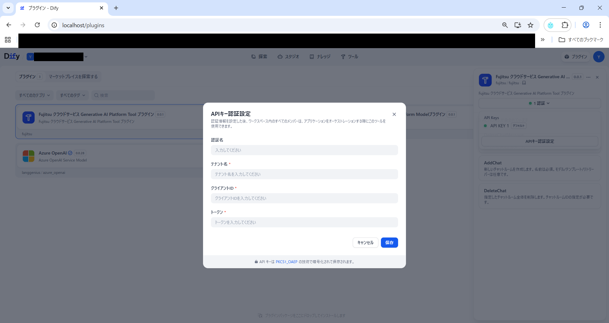
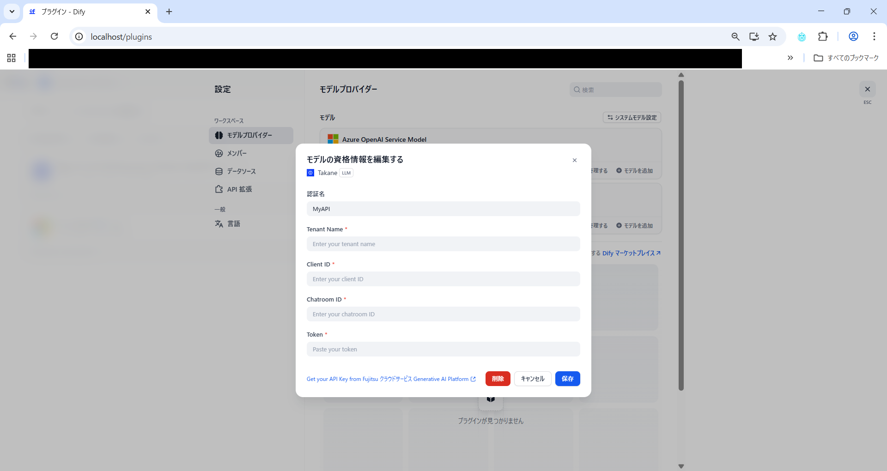
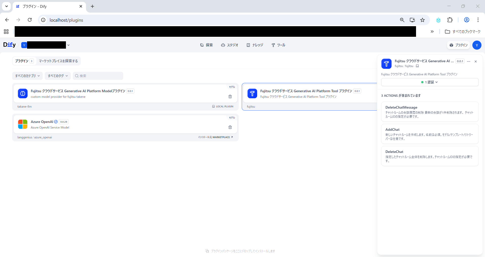

# Dify GAP API プラグイン利用手引き

## 📋 目次

- [Dify GAP API プラグイン利用手引き](#dify-gap-api-プラグイン利用手引き)
  - [📋 目次](#-目次)
  - [概要](#概要)
  - [プラグインの種類](#プラグインの種類)
  - [動作環境](#動作環境)
    - [確認済み環境](#確認済み環境)
  - [セットアップ](#セットアップ)
    - [前提条件](#前提条件)
    - [プラグインのダウンロード](#プラグインのダウンロード)
    - [認証ヘルパースクリプトの準備](#認証ヘルパースクリプトの準備)
    - [プラグインのインストール](#プラグインのインストール)
    - [認証情報の取得](#認証情報の取得)
      - [実行手順](#実行手順)
    - [プラグインへの認証情報設定](#プラグインへの認証情報設定)
      - [Tool プラグインの設定](#tool-プラグインの設定)
      - [Model プラグインの設定](#model-プラグインの設定)
  - [使用方法](#使用方法)
    - [Model プラグインの使用方法](#model-プラグインの使用方法)
      - [基本的な使い方](#基本的な使い方)
      - [⚠️ 制限事項](#️-制限事項)
    - [Tool プラグインの使用方法](#tool-プラグインの使用方法)
      - [ツールの追加方法](#ツールの追加方法)
      - [1. delete\_chat\_message](#1-delete_chat_message)
      - [2. add\_chat](#2-add_chat)
      - [3. delete\_chat](#3-delete_chat)
  - [GAP API 対応表](#gap-api-対応表)
  - [トラブルシューティング](#トラブルシューティング)
    - [エラー: "AI 応答の生成に失敗しました。チャット履歴に送信済みメッセージが残っている可能性があります。再試行する前に、チャットルームから直前のメッセージを削除してください。詳細: "](#エラー-ai-応答の生成に失敗しましたチャット履歴に送信済みメッセージが残っている可能性があります再試行する前にチャットルームから直前のメッセージを削除してください詳細-)
  - [セキュリティに関する注意事項](#セキュリティに関する注意事項)
    - [🔒 トークンの管理](#-トークンの管理)
  - [更新履歴](#更新履歴)

## 概要

本プラグインは、Dify 上で Generative AI Platform（GAP）API を利用可能にするためのプラグインです。
GAP API と Dify を統合することで、Dify のワークフロー内から GAP の LLM との会話機能を活用できます。

## プラグインの種類

本リポジトリでは以下の 2 種類のプラグインを提供しています：

| プラグイン種類       | 説明                                          | 利用可能な GAP API                         |
| -------------------- | --------------------------------------------- | ------------------------------------------ |
| **Model プラグイン** | GAP の LLM との会話を Dify のモデルとして利用 | Add Chat Messages, Create Next Ai Message  |
| **Tool プラグイン**  | GAP のルーム操作を Dify のツールとして利用    | Add Chat, Delete Chat, Remove Last Message |

## 動作環境

### 確認済み環境

- **Dify**: コミュニティ版
- **OS**: Linux(WSL で動作確認を実施しています)
- **Python**: 3.11 以上（認証ヘルパースクリプト実行用）

## セットアップ

### 前提条件

- Dify コミュニティ版がインストール済みであること
  - インストール手順は、以下の公式ドキュメントを参照してください。
    - [https://docs.dify.ai/ja/self-host/quick-start/docker-compose](https://docs.dify.ai/ja/self-host/quick-start/docker-compose)
  - (補足) WSL 環境でのインストール手順の詳細については、以下の記事も参考になります。
    - [https://qiita.com/yutaka-tanaka/items/1cebb6db744aa5a01f0c](https://qiita.com/yutaka-tanaka/items/1cebb6db744aa5a01f0c)
- Python 3.11 以上がインストール済みであること
- GAP のテナント名、クライアント ID を取得済みであること
- GAP アプリの認証に使用する Entra ID のアカウントを持っていること

### プラグインのダウンロード

以下のファイルをダウンロードしてください：

- `gap-model-plugin.difypkg` - Model プラグイン
- `gap-tool-plugin.difypkg` - Tool プラグイン
- `auth_helper.py` - 認証ヘルパースクリプト

### 認証ヘルパースクリプトの準備

1. `auth_helper.py`をローカル PC の任意の場所に配置
2. コマンドプロンプトまたはターミナルで配置した場所に移動

### プラグインのインストール

1. Dify の管理画面で「プラグイン」セクションに移動
2. 「ローカルプラグインのインストール」を選択
3. ダウンロードした`.difypkg`ファイルを選択してインストール
   - まず `gap-model-plugin.difypkg` を選択してインストール
   - 次に `gap-tool-plugin.difypkg` を選択してインストール


**両方のプラグイン（Model、Tool）をそれぞれインストールしてください。**

> **💡 ヒント**: インストールが成功すると、プラグイン一覧に「Fujitsu クラウドサービス Generative AI Platform Model プラグイン」と「Fujitsu クラウドサービス Generative AI Platform Tool プラグイン」が表示されます。



### 認証情報の取得

⚠️ **重要**: 取得した認証トークンは機微情報（API シークレット相当）として厳重に管理してください。

#### 実行手順

1. コマンドプロンプトで以下のコマンドを実行：

```bash
python auth_helper.py --tenant <テナント名> --client-id <クライアントID>
```

2. ブラウザが自動的に起動し、Entra ID のログイン画面が表示されます
3. Entra ID でログインを完了
4. コマンドプロンプトに取得したトークン情報が表示されます

**表示されるトークン情報：**

```
>python auth_helper.py --tenant <テナント名> --client-id <クライアントID>
eyJ0eXAiOiJKV1QiLCJhbGc...(長い文字列)
```

**⚠️ 重要**: 表示されたトークン全体をコピーして、安全な場所に保存してください。このトークンは次のステップで使用します。

### プラグインへの認証情報設定

#### Tool プラグインの設定

1. Dify の「インストール済みプラグイン」一覧から「Fujitsu クラウドサービス Generative AI Platform Tool プラグイン」を選択
2. プラグインの設定画面が表示されます
3. 認証情報編集画面で以下の情報を入力：
   - **テナント名**: GAP のテナント名
   - **クライアント ID**: GAP のクライアント ID
   - **トークン**: 認証ヘルパースクリプトで取得したトークン(Tool,Model プラグインで併用可)
4. 「保存」ボタンをクリックして設定を保存



#### Model プラグインの設定

1. Dify の「モデルプロバイダー一覧」一覧から「Fujitsu」を選択
2. プラグインの設定画面が表示されます
3. 認証情報編集画面で以下の情報を入力：
   - **テナント名**: GAP のテナント名
   - **クライアント ID**: GAP のクライアント ID
   - **チャットルーム ID**: 使用する GAP のチャットルーム ID
   - **トークン**: 認証ヘルパースクリプトで取得したトークン(Tool,Model プラグインで併用可)
4. 「保存」ボタンをクリックして設定を保存



> **📝 注意**: チャットルーム ID は GAP アプリの URL から確認できます。Model プラグインでは、指定したチャットルームに対してメッセージの送受信が行われます。

## 使用方法

### Model プラグインの使用方法

Model プラグインは、他の LLM モデルプラグイン（OpenAI、Anthropic など）と同様に Dify のワークフローで使用できます。

#### 基本的な使い方

1. Dify のワークフロー編集画面を開く
2. 「LLM」ノードをワークフローに追加
3. LLM ノードの設定で、モデルプロバイダーから「Fujitsu」を選択
4. モデル一覧から使用するモデルを選択
5. プロンプト（入力テキスト）を設定
6. ワークフローを実行すると、GAP の LLM が応答を返します

#### ⚠️ 制限事項

以下の点にご注意ください：

| 項目                     | 制限内容                                                                                                                                                                          |
| ------------------------ | --------------------------------------------------------------------------------------------------------------------------------------------------------------------------------- |
| **トークン数・料金表示** | ダミー表記であり、実際の使用量とは異なります                                                                                                                                      |
| **モデルパラメータ**     | Temperature 等の設定は機能しません GAP アプリのチャットルーム設定が使用されます                                                                                                   |
| **システムプロンプト**   | 機能しません ユーザーメッセージのみが LLM に渡されます                                                                                                                            |
| **チャット履歴の削除**   | Dify 上でチャット履歴から一部メッセージを削除しても、GAP アプリ側には反映されません チャット履歴から以前のメッセージを削除する場合は、GAP アプリまたは GAP API を使用してください |

### Tool プラグインの使用方法

Tool プラグインには、GAP のチャットルームを操作するための以下の 3 つのツールが含まれています。これらのツールは、Dify のワークフロー内で「ツール」ノードとして利用できます。



#### ツールの追加方法

1. Dify のワークフロー編集画面で「ツール」ノードを追加
2. ツール選択画面で「Fujitsu」配下のツールを選択
3. 必要なパラメータを設定して実行

---

#### 1. delete_chat_message

指定したチャットルームの最新のメッセージを 1 つ削除します。

**パラメータ：**

- `チャットルームID` (必須): 対象のチャットルーム ID

---

#### 2. add_chat

新しいチャットルームを作成します。作成されたチャットルームは GAP アプリ上で確認でき、作成後は Model プラグインでの利用や、他のツールでの操作が可能になります。

**パラメータ：**

- `チャットルーム名` (必須): 作成するチャットルームの名前
- `リトリーバーID` (オプション): 関連付けるリトリーバーの ID

**実行結果：**

- 成功時: 新しく作成されたチャットルーム ID が返されます
- この ID は、後続の処理で使用できます

---

#### 3. delete_chat

指定したチャットルームを削除します。削除されたチャットルームは復元できませんので、実行前に確認してください。

**パラメータ：**

- `チャットルームID` (必須): 削除対象のチャットルーム ID

**実行結果：**

- 成功時: チャットルームが削除され、成功メッセージが返されます
- 失敗時: エラーメッセージが表示されます（存在しない ID を指定した場合など）

## GAP API 対応表

| GAP API                | 対応プラグイン | 利用可否    |
| ---------------------- | -------------- | ----------- |
| Add Chat               | Tool           | ✅ 利用可能 |
| List Chats             | -              | ❌ 未対応   |
| Add Chat Messages      | Model          | ✅ 利用可能 |
| Create Next Ai Message | Model          | ✅ 利用可能 |
| Remove Last Message    | Tool           | ✅ 利用可能 |
| Get Chat Messages      | -              | ❌ 未対応   |
| Delete Chat            | Tool           | ✅ 利用可能 |
| Update Chat            | -              | ❌ 未対応   |
| Get Chat               | -              | ❌ 未対応   |
| Add File From Url      | -              | ❌ 未対応   |
| Create Retriever       | -              | ❌ 未対応   |
| Embedding Files        | -              | ❌ 未対応   |
| File List              | -              | ❌ 未対応   |
| Retriever List         | -              | ❌ 未対応   |
| Upload Files           | -              | ❌ 未対応   |
| Delete File            | -              | ❌ 未対応   |
| Delete Retriever       | -              | ❌ 未対応   |

## トラブルシューティング

### エラー: "AI 応答の生成に失敗しました。チャット履歴に送信済みメッセージが残っている可能性があります。再試行する前に、チャットルームから直前のメッセージを削除してください。詳細: "

このエラーは、Model プラグインの実行時に表示されることがあります。

**原因**: メッセージ送信処理での問題

**対処方法**:

1. `delete_chat_message`ツールを使用
2. エラー直前に送信されたユーザーメッセージを削除
3. 再度メッセージを送信

**実行手順：**

```
1. delete_chat_messageツールを実行
   - チャットルームID: <エラーが発生したチャットルームID>
2. 再度Modelプラグインを実行
```

## セキュリティに関する注意事項

### 🔒 トークンの管理

認証ヘルパースクリプトで取得したトークンは、**API シークレットと同等の機微情報**です。

**必ず以下を守ってください：**

- ❌ トークンを他人と共有しない
- ❌ Git や Public リポジトリにコミットしない
- ❌ トークンをチャットやメールで送信しない
- ❌ トークンをスクリーンショットに含めない

---

## 更新履歴

- 2025-11-27: 初版リリース
- 2026-01-05: Dify コミュニティ版のインストール方法について、公式ドキュメントへの参照を追加
